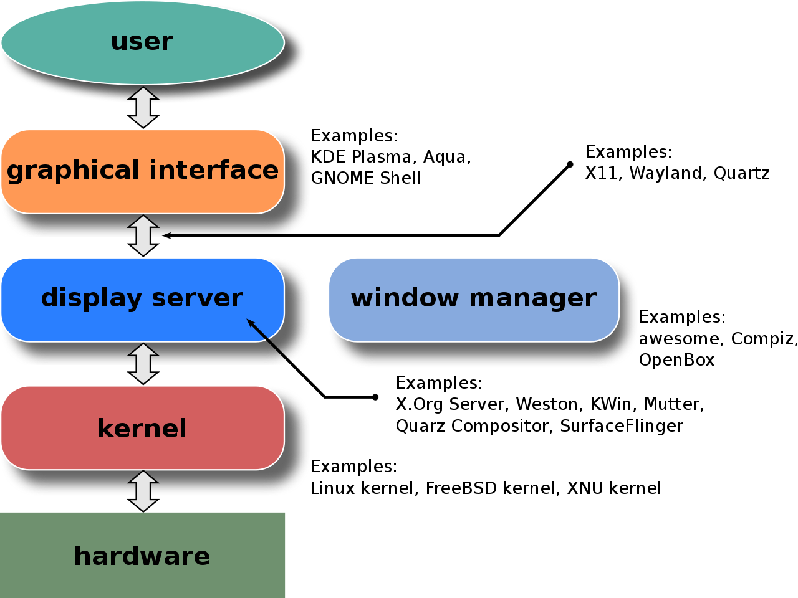

# Fundamental concepts
A **windowing system** (or **window system**) is a software suite for GUI that manages separately different parts of electronic visual display windows. Be not to confused the word **windows** in **windowing system** (for display window) to Microsoft Windows Operating system.

The main component of any windowing system is usually called the **display server**. Any application that runs and presents its GUI in a window, is a client of the display server. The display server and its clients communicate with each other over a **communications protocol**, which is usually called **display server protocol**.



As can be seen from the diagram, display server receives all the input from the kernel, that the kernel receives from all attached input devices, such as keyboard, pointing devices, or touchscreen and transmits it to the correct client. 

## X11

One example of a display server is the **X.Org Server**, which runs on top of the Unix-like kernel, such as Linux or BSD. **X.Org Server** is part of the **X Window System** or **X11**, a windowing system for bitmap displays on Unix-like operating systems. 

Be not to confused the word **window** in **X Window System** (for Unix-like display) to Microsoft Windows Operating system. 

For example, [GUI display on WSL require X11 install](https://github.com/TranPhucVinh/Windows-Batch/blob/master/Environment/Windows%20Subsystem%20for%20Linux.md#running-gui).

The display server communications protocols of X11 is **X Window System core protocol**. The **X Window System**/**X11** is based on a client–server model: a single server controls the input/output hardware, such as the screen, the keyboard, and the mouse; all application programs act as clients, interacting with the user and with the other clients via the server. This interaction is regulated by the **X Window System core protocol**. 

``xeyes``, ``xlock``,... are software of X11.

# Commands

## GUI setup

``Ctrl+Alt+F1`` to ``Ctrl+Alt+F6``: enter terminal from ``tty1`` to ``tty6``, which is also known as text terminal.

``Ctrl+Alt+F7``: switch back to desktop and terminal ``tty``.

## screen

The ``screen`` package is pre-installed on most Linux distros nowadays. Install: ``sudo apt install screen``

To end ``screen``: ``Ctr+A+D``.

## Other commands

``xrandr --size 1366x768``: Change size of current screen to ``1366x768``

``\033[8;h;wt`` can be used to change the size of the current running terminal. ``\033`` is the ASCII control character ``ESC``, and ``h`` and ``w`` are height and width in decimal.

```sh
printf '\033[8;64;240t' #must have ''
```
# Desktop applications

## Text editor

By default, Linux support 2 terminal text editors, ``vim`` (with command ``vi``) and nano (with command ``nano``).

``vi`` is extremely light while ``nano`` has bigger size. In some lightweight OS, like some Xilinx OS deployed in the Automotive drive monitoring system, only ``vim`` is supported.

For nano, check [nano document](https://github.com/TranPhucVinh/Linux-Shell/blob/master/Physical%20layer/File%20system/Write%20operations.md#nano).
## Spreadsheet

``libreoffice --writer file.odt`` or ``libreoffice --writer file.doc: Open libreoffice doc``

LibreOffice use LibreOffice Basic, which is the derivatives of OpenOffice Basic, to import Macro.

## Visual Studio Code

To preview and export Markdown efifciently in Visual Studio Code, use ``Markdown Preview Enhanced`` by Yiyi Wang. 

Install: 

Launch VS Code Quick Open (Ctrl+P), paste the following command, and press enter:

``ext install shd101wyy.markdown-preview-enhanced``
