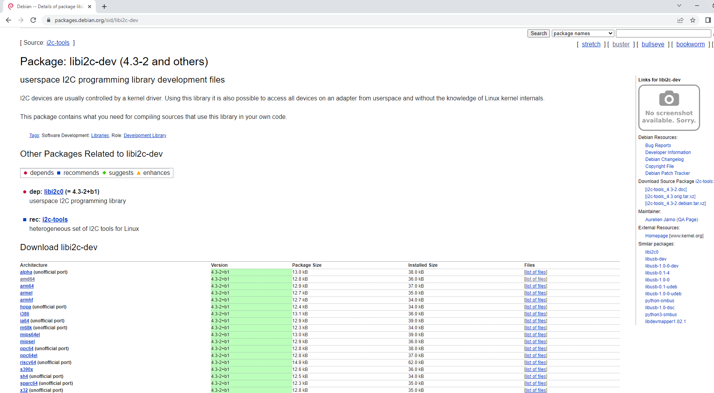
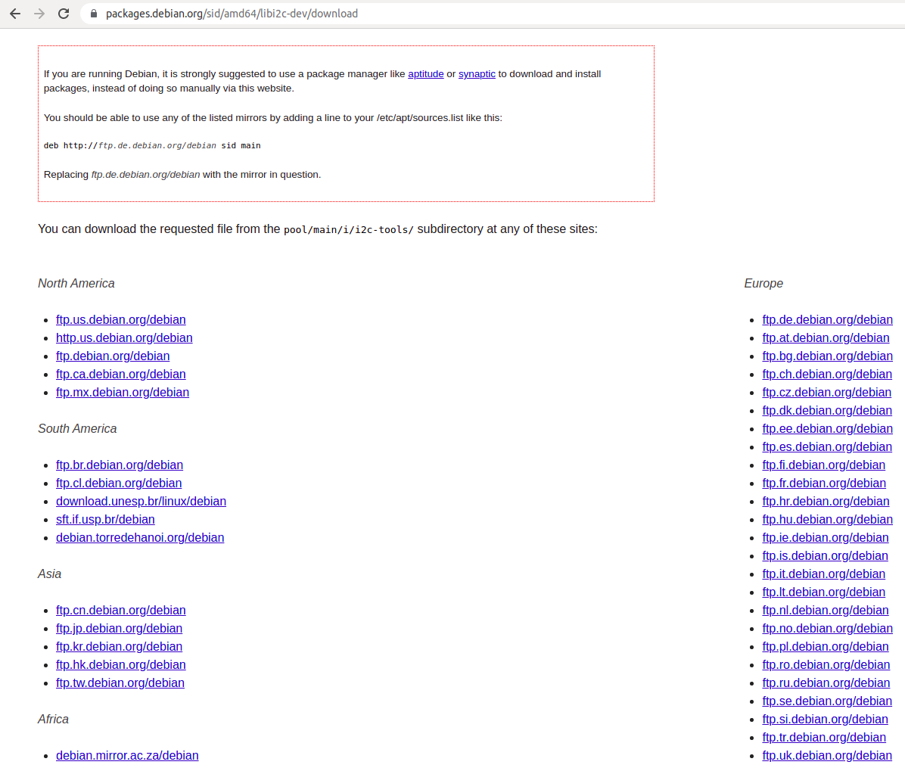

### Install new package

**Install packages**: ``sudo apt install package_name1 package_name2``, ``sudo apt-get install package_name``

**Check for availabe of package version**: ``sudo apt policy package_name``

**Install an installed debian package**: ``sudo dpkg -i leaf_latest.deb``

### Download a Debian package from link and get its file source

Take this example to download [libi2c-dev](https://packages.debian.org/sid/libi2c-dev) package.

Get to the download page



In **Download libi2c-dev**, **Architecture** choose [amd64](https://packages.debian.org/sid/amd64/libi2c-dev/download). This will then redirect you to the FTP download link webpage.

 -> In North America ftp.us.debian.org/debian, right click and choose copy link, the link copied is http://ftp.us.debian.org/debian/pool/main/i/i2c-tools/libi2c-dev_4.3-2+b1_amd64.deb

Download the Debian package from this link with ``curl`` and export it as ``libi2c-dev.deb``:

```sh
curl -o libi2c-dev.deb http://ftp.us.debian.org/debian/pool/main/i/i2c-tools/libi2c-dev_4.3-2+b1_amd64.deb
```

Extract that file:

```sh
dpkg -x libi2c-dev.deb .
```

``.`` will extract the file to ``usr`` folder.

``usr`` folder will include:

```sh
├── include
│   └── i2c
│       └── smbus.h
├── lib
│   └── x86_64-linux-gnu
│       ├── libi2c.a
│       └── libi2c.so -> libi2c.so.0
└── share
    └── doc
        └── libi2c-dev
            ├── changelog.Debian.amd64.gz
            ├── changelog.Debian.gz
            ├── changelog.gz
            ├── copyright
            └── dev-interface.gz
```

``i2c/smbus.h`` can be used as the header file for other source code while ``libi2c.a`` is the static library source code. Check [libi2c-dev static library in Bazel for this implementation](https://github.com/TranPhucVinh/Linux-Shell/blob/master/Bash%20script/Build%20automation%20tools/Bazel/C%20source%20files.md#static-library).
