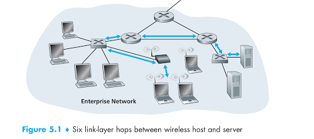

# Fundamental concepts

Consider that any device that runs a link-layer (i.e., layer 2) protocol as a **node**. Nodes include
hosts, routers, switches, and WiFi access points. We will also refer to the communication channels that connect adjacent nodes along the communication path as **links**.

As an example, in the company network shown at the bottom of Figure 5.1, consider sending a datagram from one of the wireless hosts to one of the servers. This datagram will actually pass through **six links**: a **WiFi link** between sending host and WiFi access point, an **Ethernet link** between the access point and a link-layer switch; a **link** between the link-layer switch and the router, a link between the two routers; an **Ethernet link** between the router and a link-layer switch; and finally an **Ethernet link** between the switch and the server. Over a given link, a transmitting node encapsulates the datagram in a **link-layer frame** and transmits the frame into the link.

## Where is the link layer implemented ?

We’ll focus here on an end system, since we learned that the link layer is implemented in **a router’s line card**.

Is **a host’s link layer** implemented in **hardware** or **software**? Is it implemented on a separate card or chip, and **how does it interface with the rest of a host’s hardware and operating system components**?

For the most part, the link layer is implemented in a **network adapter**, also sometimes known as a **network interface card** (NIC). At the heart of the **network adapter** is the **link-layer controller**, usually a **single, special-purpose chip** that implements many of the link-layer services (**framing, link access, error detection, and so on**). **Thus, much of a link-layer controller’s functionality is implemented in hardware**.

While most of the **link layer** is implemented in **hardware**, **part of the link layer** is implemented in **software** that runs on the host’s CPU. The **software** components of the link layer implement **higher-level link-layer** functionality such as **assembling link-layer addressing information** and **activating the controller hardware**. On the receiving side, **link-layer software** responds to **controller interrupts** (e.g., due to the receipt of one or more frames), **handling error conditions** and **passing a datagram up to the network layer**. Thus, **the link layer is a combination of hardware and software—the place in the protocol stack where software meets hardware**.

## Types of link layer channels

There are two fundamentally different types of link-layer channels: **point to point** and **broadcast**.

### Broadcast channels

**Broadcast channels** connect **multiple hosts** in **wireless LANs**, **satellite networks**, and **hybrid fiber-coaxial cable (HFC) access networks**. Broadcast link-layer **Ethernet** and **wireless LANs** are examples of broadcast link-layer technologies.

In **broad cast channel**, because **all nodes are capable of transmitting frames**, **more than two nodes can transmit frames at the same time**. When this happens, **all of the nodes receive multiple frames at the same time**; that is, **the transmitted frames collide at all of the receivers**. Typically, when there is a collision, none of the receiving nodes can make any sense of any of the frames that were transmitted; in a sense, the signals of the colliding frames become inextricably tangled together. Thus, all the frames involved in the collision are lost, and the broadcast channel is wasted during the collision interval. Clearly, if many nodes want to transmit frames frequently, many transmissions will result in collisions, and much of the bandwidth of the broadcast channel will be wasted.

In order to ensure that the broadcast channel performs useful work when multiple nodes are active, it is necessary to somehow **coordinate the transmissions of the active nodes**. This coordination job is the **responsibility of the multiple access protocol**.

### Point to point

**Point-to-point** communication link is often found between **two routers connected by a long-distance link**, or between **a user’s office computer** and **the nearby Ethernet switch** to which it is connected.

A point-to-point link consists of **a single sender** at one end of the link and **a single receiver** at the other end of the link. Many **link-layer protocols** have been designed for **point-to-point links**; the **point-to-point protocol (PPP)** and **high-level data link control (HDLC)** are two such protocols.
### Multiple Access Protocols

We can classify the multiple access protocols into **three categories**:

* **channel partitioning protocols**
* **random access protocols**
* **taking-turns protocols**

**Channel partitioning protocols** include algorithm working with TDM and FDM

**Random access protocols**:

In a **random access protocol**, a transmitting node always transmits at **the full rate of the channel**, namely, R bps. When there is a collision, each node involved in the collision **repeatedly retransmits its frame** (that is, packet) until its frame gets through without a collision. But when a node experiences a collision, it **doesn’t necessarily retransmit the frame right away**. Instead **it waits a random delay before retransmitting the frame**. Each node involved in a collision **chooses independent random delays**. Because the random delays are independently chosen, **it is possible** that one of the nodes will pick a delay that is **sufficiently less than the delays of the other colliding nodes** and will therefore be able to sneak its frame into the channel without a collision.

**There are dozens if not hundreds of random access protocols described in the literature**. In this section we’ll describe a few of the most commonly used **random access protocols**—**the ALOHA protocols** and **the carrier sense multiple access (CSMA) protocols**. **Ethernet** is a popular and widely deployed **CSMA protocol**.

# MAC address and ARP

**Hosts** and **routers** have **link-layer addresses**, as well as having **network-layer addresses** (in network layer).

## MAC Addresses

In truth, it is not hosts and routers that have link-layer addresses but rather **their adapters (that is, network interfaces)** that have **link-layer addresses**. A link-layer address is variously called a **LAN address**, a **physical address**, or a **MAC address**.

**One interesting property of MAC addresses is that no two adapters have the same address**. This might seem surprising given that adapters are manufactured in many countries by many companies. **How does a company manufacturing adapters in Taiwan make sure that it is using different addresses from a company manufacturing adapters in Belgium?** The answer is that **the IEEE manages the MAC address space**. In particular, **when a company wants to manufacture adapters**, **it purchases a chunk of the address space consisting of 2^24 addresses for a nominal fee**. **IEEE allocates the chunk of 2^24 addresses by fixing the first 24 bits of a MAC address and letting the company create unique combinations of the last 24 bits for each adapter**.

## ARP

**ARP**, **Address Resolution Protocol**, is a communication protocol used for discovering the link layer address, such as a MAC address, associated with a given internet layer address, typically an IPv4 address.

Because there are both **network-layer addresses** (for example, **Internet IP addresses**) and **link-layer addresses (that is, MAC addresses)**, there is a need to translate between them. For the Internet, this is the job of the **Address Resolution Protocol (ARP)**.

**ARP** resolves an **IP address** to a **MAC address**. In many ways it is analogous to DNS, which resolves **host names** to **IP addresses**. However, one important difference between the two resolvers is that **DNS resolves host names for hosts anywhere in the Internet**, whereas **ARP resolves IP addresses only for hosts and router interfaces on the same subnet**.

### How ARP works

Each **host** and **router** has an **ARP table** in its memory, which contains mappings of **IP addresses** to **MAC addresses**.

In particular, suppose ``222.222.222.220`` wants to send a datagram to ``222.222.222.222``. In this case, the sender uses the **ARP protocol** to resolve the address. First, the sender constructs a special packet called an **ARP packet**. An ARP packet has several fields, including the sending and receiving IP and MAC addresses.

Students often wonder if **ARP is a link-layer protocol or a network-layer protocol**. As we’ve seen, an ARP packet is **encapsulated** within a **link-layer frame** and thus **lies architecturally above the link layer**. However, **an ARP packet** has fields containing **link-layer addresses** and thus is arguably a **link-layer protocol**, but it also contains **network-layer addresses** and thus is also arguably a network-layer protocol. In the end, **ARP is probably best considered a protocol that straddles the boundary between the link and network layers**—not fitting neatly into the simple layered protocol stack. Such are the complexities of real-world protocols!

### Implementations

Install: ``sudo apt-get install arp-scan``

Scan all existed IP inside the network along with the MAC address: ``sudo arp-scan -l``

# Ethernet

A **hub** is a physical-layer device that **acts on individual bits** rather than **frames**. When a bit, representing a zero or a one, arrives from one interface, **the hub simply re-creates the bit**, **boosts its energy strength**, and **transmits the bit onto all the other interfaces**. Thus, Ethernet with a hub-based star topology is also a broadcast LAN—**whenever a hub receives a bit from one of its interfaces**, **it sends a copy out on all of its other interfaces**. In particular, **if a hub receives frames from two different interfaces at the same time**, **a collision occurs and the nodes that created the frames must retransmit**.

Historically, an Ethernet was initially conceived of as a segment of coaxial cable. **The early 10BASE-2 and 10BASE-5 standards specify 10 Mbps Ethernet over two types of coaxial cable, each limited in length to 500 meters**. Longer runs could be obtained by using **a repeater**—**a physical-layer device that receives a signal on the input side, and regenerates the signal on the output side**.
