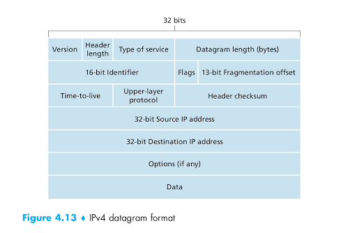
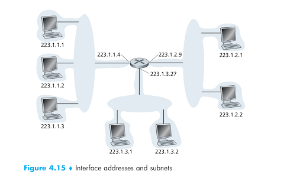
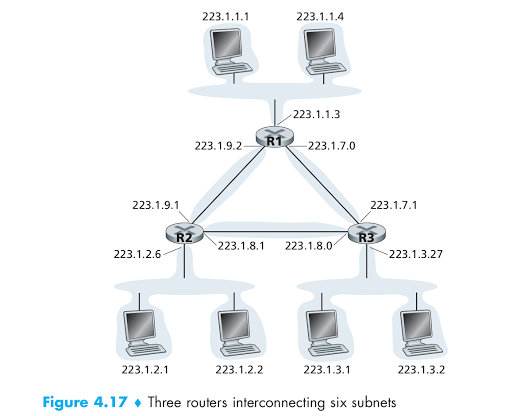

Be not to confuse **IP** with **IP address** as the **IP address** is a part of the IP datagram.



The **IP datagram** include: Version number, Header length, Type of service, Datagram length,...., IP address,..., data (aka payload) (as can see in the picture)

# IPv4 Addressing

## How hosts and routers are connected into the network.

A host typically has only **a single link** into the network; when IP in the host wants to send a datagram, it does so over this link. **The boundary** between the host and the physical link is called **an interface**. Now consider **a router** and **its interfaces**. Because a router’s job is to **receive a datagram** on one link and **forward the datagram** on some other link, a router necessarily **has two or more links** to which it is connected. **The boundary** between the router and any one of its links is also called **an interface**. A router thus has **multiple interfaces**, one for each of its links. Because **every host and router is capable of sending and receiving IP datagrams**, **IP requires each host and router interface to have its own IP address**. Thus, **an IP address is technically associated with an interface**, **rather than with the host or router containing that interface**.

## IP address

Each **interface** on every **host** and **router** in the global Internet must have an **IP address** that is **globally unique** (except for interfaces behind NATs).



In IP terms, this network interconnecting three host interfaces and one router interface (in the left side of the figure) forms a **subnet**. **IP addressing** assigns an address to this **subnet**: 223.1.1.0/24, where the /24 notation, sometimes known as a **subnet mask**, **indicates that the leftmost 24 bits of the 32-bit quantity define the subnet address**. **The subnet 223.1.1.0/24** thus consists of the **three host interfaces** (223.1.1.1, 223.1.1.2, and 223.1.1.3) and **one router interface** (223.1.1.4). Any **additional hosts** attached to the 223.1.1.0/24 subnet would be required to have an address of the form 223.1.1.xxx. There are two additional subnets shown in **Figure 4.15**: **the 223.1.2.0/24 network** and **the 223.1.3.0/24 subnet**.



## Private IP
RFC 1918 define private Internet IP

**Valid IP private**

* Class A: 10.x.x.x
* Class B: 172.16.x.x -> 172.31.x.x
* Class C: 192.168.x.x

The IP address **127.0.0.1** is called a **loopback address** or **loopback IP**. Packets sent to this address never reach the network but are looped through the network interface card only. This can be used for diagnostic purposes to verify that the internal path through the TCP/IP protocols is working.

In both Windows and Linux, when selecting which of a host's IP address to use as a source IP, a program may specify [INADDR_ANY](https://github.com/TranPhucVinh/C/blob/master/Transport%20layer/API.md#sockaddr-in_addr-sockaddr_in) (**0.0.0.0**), i.e The IP address **0.0.0.0** is bound to the IP address of the current device. 

# IP addressing in the global Internet

The Internet’s address assignment strategy is known as **Classless Interdomain
Routing (CIDR—pronounced cider)** [RFC 4632]. **CIDR** generalizes the notion of subnet addressing. As with subnet addressing, **the 32-bit IP address is divided into two parts and again has the dotted-decimal form a.b.c.d/x**, where x indicates the number of bits in the first part of the address.

## Obtaining a Host Address: the Dynamic Host Configuration Protocol

Once an organization has obtained a block of addresses, **it can assign individual IP addresses to the host and router interfaces in its organization**. A system administrator will **typically manually configure** the IP addresses **into the router** (often remotely, with a network management tool). **Host addresses** can also be configured manually, **but more often this task is now done using the Dynamic Host Configuration Protocol (DHCP)** [RFC 2131].

**DHCP** allows a host to obtain (be allocated) **an IP address automatically**. A network administrator can configure **DHCP** so that a given host receives **the same IP address** each time it connects to the network, or a host may be **assigned a temporary IP address** that will be **different** each time the host connects to the network.

**DHCP** is a **client-server protocol**. A **client** is typically a newly arriving host wanting to obtain network configuration information, including an **IP address** for itself.

# IP commands

## Check IP of current Linux device

```
ip addr show
```
## nmap

``nmap`` has to be installed

``nmap -sP 192.168.1.*``: scan all IP connected to a network

## ping

You can only ``ping`` to a station that has opened a port for listening, like a HTTP server with port 80. If pinging to a station with no opened port like a device simply connect to WiFi, there will be error: ``Destination Host Unreachable``

**Example**: ESP8266 simply connects to WiFi and has IP ``192.168.0.100``. Then ``ping 192.168.0.100`` will have error ``Destination Host Unreachable``

If ESP8266 then starts a HTTP server, then you can ``ping 192.168.0.100`` normally.

``ping -i 3 google.com``: set an interval of 3 second

``ping -s 80 google.com``: set package size of 80

``ping -c 1 google.com``: ping for only 1 package
