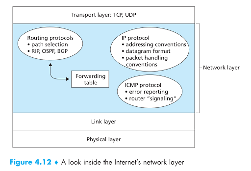

The Internet’s network layer is responsible for moving network-layer packets known as datagrams from one host to another. The Internet transport-layer protocol (TCP or UDP) in a source host passes a transport-layer segment and a destination address to the network layer, just as you would give the postal service a letter with a destination address. The network layer then provides the service of delivering the segment to the transport layer in the destination host.

The Internet’s network layer includes the celebrated **IP Protocol**, which defines the fields in the datagram as well as how the end systems and routers act on these fields. There is only one IP protocol, and all Internet components that have a network layer must run the IP protocol. The Internet’s network layer also contains **routing protocols** that determine the routes that datagrams take between sources and destinations. The Internet has many routing protocols. As we saw in Section 1.3, the Internet is a network of networks, and within a network, **the network administrator** can run any routing protocol desired. Although the network layer contains both the IP protocol and numerous routing protocols, it is often simply referred to as the IP layer, reflecting the fact that IP is the glue that binds the Internet together.



**The Internet’s network layer has three major components**:
* IP protocol.
* **Routing component**, which determines the path a datagram follows from source to destination. We mentioned earlier that **routing protocols** compute the forwarding tables that are used to forward packets through the network.
* **[Internet Control Message Protocol (ICMP)](#ICMP)**: The facility to report errors in datagrams and respond to requests for certain network-layer information

# Network Service Models

Let’s now consider some possible services that the network layer could provide. In the sending host, **when the transport layer passes a packet to the network layer**, specific services that could be provided by the network layer include:

• **Guaranteed delivery**: This service guarantees that the packet will eventually arrive at its destination.

• **Guaranteed delivery with bounded delay**. This service not only guarantees delivery of the packet, but delivery within a specified host-to-host delay bound (for example, within 100 msec).

Furthermore, the following services could be provided to a flow of packets between a given source and destination:

• **In-order packet delivery**: This service guarantees that packets arrive at the destination in the order that they were sent.

• **Guaranteed minimal bandwidth**: This network-layer service emulates the behavior of a transmission link of a specified bit rate (for example, 1 Mbps) between sending and receiving hosts. As long as the sending host transmits bits (as part of packets) at a rate below the specified bit rate, then no packet is lost and each packet arrives within a prespecified host-to-host delay (for example, within 40 msec).

• **Guaranteed maximum jitter**: This service guarantees that the amount of time between the transmission of two successive packets at the sender is equal 
to the amount of time between their receipt at the destination (or that this spacing changes by no more than some specified value).

• **Security services**. Using a **secret session** key known only by a source and destination host, the network layer in the source host could **encrypt** the payloads of all datagrams being sent to the destination host. The network layer in the destination host would then be responsible for decrypting the payloads. With such a service, confidentiality would be provided to all transport-layer segments (TCP and UDP) between the source and destination hosts. In addition to confidentiality, the network layer could provide data integrity and source authentication services.

# Forwarding and routing in network layer
Distinction between the **forwarding** and **routing** functions of the network layer:

* **Forwarding** involves the transfer of a packet from an incoming link to an outgoing link within a single router. 
* **Routing** involves all of a network’s routers, whose collective interactions via routing protocols determine the paths that packets take on their trips from source to destination node.

We’ll see that the job of a **routing algorithm** is to determine good paths (equivalently, routes) from senders to receivers.

Every router has a **forwarding table**. A router forwards a packet by examining the value of a field in the arriving packet’s header, and then using this header value to index into the router’s forwarding table. The value stored in the forwarding table entry for that header indicates the router’s outgoing link interface to which that packet is to be forwarded. Depending on the network-layer protocol, the header value could be the destination address of the packet or an indication of the connection to which the packet belongs.

Some packet switches, called **link-layer switches**, base their forwarding decision on values in the fields of the link-layer frame; **switches** are thus referred to as **link-layer (layer 2) devices**. Other packet switches, called **routers**, base their forwarding decision on the value in the network-layer field. **Routers** are thus **network-layer (layer 3)** devices, but must **also implement layer 2 protocols** as well, since layer 3 devices require the services of layer 2 to implement their (layer 3) functionality.
# Virtual Circuit and Datagram Networks

Transport layer can offer applications connectionless service (**UDP**) or connection-oriented service (**TCP**) between two processes. In a similar manner, a network layer can provide **connectionless service** or **connection service** between **two hosts**.

For example, a network-layer connection service **begins with handshaking** between the source and destination hosts; and a network-layer connectionless service **does not have** any handshaking preliminaries.

Computer networks that provide only a **connection service** at the network layer are called **virtual-circuit (VC) networks**; computer networks that provide only a **connectionless service** at the network layer are called **datagram networks**.

**Virtual-circuit** and **datagram networks** are two fundamental classes of computer networks.

## Virtual-Circuit Networks

A virtucal-circuit (VC) consists of 

* (1) a path (that is, a series of links and routers) between the source and destination hosts.
* (2) VC numbers, one number for each link along the path
* (3) entries in the forwarding table in each router along the path.

**A packet** belonging to a **virtual circuit** will carry a **VC number** in its header. Because a virtual circuit may have a **different VC number on each link**, each intervening router must **replace the VC number** of **each traversing packet with a new VC number**. The **new VC number is obtained from the forwarding table**.

## Datagram Networks

In a datagram network, each time an end system wants to send a packet, it **stamps** the packet with the **address of the destination end system** and then pops the packet into the network.

As a packet is transmitted from **source to destination**, it passes through a series of routers. Each of these routers uses the packet’s destination address to forward the packet. Specifically, **each router** has a **forwarding table** that maps destination addresses to **link interfaces**; when a packet arrives at the router, the router uses the packet’s destination address to **look up the appropriate output link interface** in the **forwarding table**.

In a **datagram network** the **forwarding tables** are modified by the **routing algorithms**, which typically update a forwarding table **every one-to-five minutes or so**. In a **VC network**, a **forwarding table** in a router is modified whenever **a new connection is set up through the router** or **whenever an existing connection through the router is torn down**.

The virtual circuit evolve from the telephony world. The Internet as **a datagram network**, on the other hand, grew out of the need to connect computers together. Given more **sophisticated end-system devices**, the Internet architects chose to make the network-layer service model as simple as possible.

Since the resulting Internet network-layer service model makes **minimal (no!) service guarantees**, it imposes minimal requirements on the network layer. This **makes it easier** to interconnect networks that use very different link-layer technologies (for example, satellite, Ethernet, fiber, or radio) that have very different transmission rates and loss characteristics.
# Firewall
In **firewalls** (covered in Chapter 8)—devices that filter out selected incoming packets—an incoming packet whose header matches a given criteria (e.g., a combination of source/destination IP addresses and transport-layer port numbers) may be prevented from being forwarded (action).
# NAT
In a **network address translator (NAT)**, an incoming packet whose transport-layer port number matches a given value will have its port number rewritten before forwarding (action).

NAT is a method. The **NAT-enabled router** allows **translating the private IP (IPv4) into the public IP and in vice-versa**. This will help reducing the usage number of IPv4 address so that IPv4 address isn't going to run out quickly. **NAT router** behaves to the outside world as a single device with a single **IP address**. 

NAT traversal is increasingly provided by **Universal Plug and Play (UPnP)**, which is a protocol that allows a host to discover and configure a nearby **NAT**.

**Port forwarding** or **port mapping** is an application of **NAT** that redirects a communication request from one address and port number combination to another. 

Some programming language like Python, doesn't support port fowarding by default when building the HTTP server. For example, when running [this simple Python HTTP server](https://github.com/TranPhucVinh/Python/tree/master/Application%20layer/HTTP/HTTP%20server#a-simple-http-server-to-return-a-string), just only ``localhost:8000`` returns the webpage while the IP address, e.g ``192.168.1.3:8000`` doesn't. However, port forwarding, will allow listening on the other port for that IP address, e.g ``8001``.

``socat`` command is used to implement the port forwarding. **socat isn't built-in and has to be installed**: ``sudo apt install iproute2 netcat-openbsd socat``

After running the [simple Python HTTP server](https://github.com/TranPhucVinh/Python/tree/master/Application%20layer/HTTP/HTTP%20server#a-simple-http-server-to-return-a-string) above, run the following socat command so that the webpage will be available when getting to ``IP:<port 8001>``, e.g ``192.168.1.3:8001``:

```sh
socat tcp-listen:8001,fork tcp:localhost:8000
```
* ``tcp:localhost:8000`` means the current running TCP client (localhost) on port ``8000``, ``tcp-listen:8001`` means the newly port mapping is on ``8001``
* Without ``fork``, i.e ``socat tcp-listen:8001 tcp:localhost:8000``, then loading ``192.168.1.3:8001`` is available for just only 1 time. ``fork`` will child a new child process for the port fowarding everytime we reload the webpage

**NAT implementation**: 
* [NAT port in a local ISP router for a DDNS-supported domain registered from noip](https://www.youtube.com/watch?v=DoA5jc4PRHM)
* [Port forwarding an HTTP server hosted on local PC to an EC2 domain](https://github.com/TranPhucVinh/Linux-Shell/blob/master/Platforms%20interaction/AWS/README.md#port-forwarding-an-http-server-hosted-on-local-pc-to-an-ec2-domain)

# ICMP

**ICMP**, specified in [RFC 792], is used by hosts and routers to communicate network-layer information to each other. The most typical use of ICMP is for **error reporting**. For example, when running a Telnet, FTP, or HTTP session, you may have encountered an **error message** such as “Destination network unreachable.” This message had its origins in **ICMP**.

**ICMP** is often considered part of IP but architecturally **it lies just above IP**, as **ICMP messages are carried inside IP datagrams**. That is, ICMP messages are carried **as IP payload**, just as **TCP or UDP segments are carried as IP payload**. Similarly, **when a host receives an IP datagram with ICMP specified as the upper-layer protocol**, it **demultiplexes** the datagram’s contents to ICMP, **just as it would demultiplex a datagram’s content to TCP or UDP**.

# XCP

XCP (or) "Universal Measurement and Calibration Protocol" is a **network protocol** originating from **ASAM** (Association for Standardisation of Automation and Measuring Systems) for connecting calibration systems to electronic control units, ECUs. It enables read and write access to variables and memory contents of microcontroller systems at runtime. Entire datasets can be acquired or stimulated synchronous to events triggered by timers or operating conditions. In addition, XCP also supports programming of flash memory.
