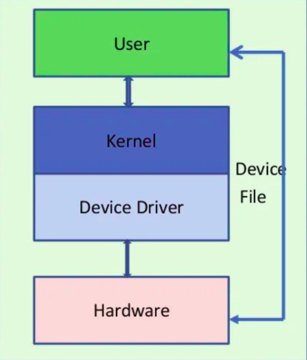

# Fundamental concepts

The **device model** involves terms like **device**, **driver**, and **bus**:
* **device**: a physical or virtual object which attaches to a bus.
* **driver**: a software entity which may probe for and be bound to devices, and which can perform certain management functions.
* **bus**: a device which serves as an attachment point for other devices.

Linux supports three types of devices: **character devices**, **block devices** and **network devices**.

* **Character devices** is any device that can have streams of characters read from or written to it without buffering, for example, keyboards, monitors, printers, serial ports, terminals, etc

Most of devices that are not block devices are represented by linux kernel as character device.

* **Block devices** is a device that composes of fixed-sized blocks, that can be read and write to store data. Block device can only be written to and read from in multiples of the block size, typically 512 or 1024 bytes. They may be randomly accessed i.e., any block can be read or written no matter where it is on the device. Block devices are hard disk, SD card,...

List all character devices and block devices with major number: ``cat /proc/devices``

**Network devices** are accessed via the BSD socket interface and the networking subsystems.

## Device drivers

User space applications are not allowed to access peripheral registers, storage media or even RAM memory directly. Instead, the hardware is accessed via kernel drivers, and RAM memory is managed by the memory management unit (MMU), with applications operating on virtual addresses. 

This kinds of access or transfering of data is handled via device nodes, which are also known as virtual files. Each device has a unique driver that handles requests from user applications that are eventually passed to the core. 

Device drivers can be kernel modules or statically built into the kernel image. The default kernel builds most drivers into the kernel statically, so they are started automatically. A kernel module is not necessarily a device driver; it is an extension of the kernel. The kernel modules are loaded into virtual memory of the kernel. Building a device driver as a module makes the development easier since it can be loaded, tested, and unloaded without rebooting the kernel. The kernel modules are usually located in ``/lib/modules/<kernel_version>/`` on the root filesystem.



A device driver has 3 sides:

* One side talk to the rest of the kernel.
* One talk to the hardware
* One talk to the user

Drivers that have been compiled into the kernel directly register their objects with a ``sysfs`` as they are detected by the kernel. For drivers compiled as modules, this registration will happen when the module is loaded.

In Linux, every device is identified by two numbers: a **major number** and a **minor number**. When accessing a device file, the major number selects which device driver is being called to perform the input/output operation, i.e represents the driver that the device is being controlled by. The major number is used by the kernel to identify the correct device driver when the device is accessed. The role of the minor number is device dependent, and is handled internally within the driver. 

For instance, the i.MX7D has several hardware UART ports. The same driver can be used to control all the UARTs, but each physical UART needs its own device node, so the device nodes for these UARTS will all have the same major number, but will have unique minor numbers.

## Other device files

**MTD**: A Memory Technology Device (MTD) is a type of device file in Linux for interacting with flash memory.

**UBIFS** file-system stands for UBI File System. UBI stands for “Unsorted Block Images”. UBIFS is a flash file system, which means it is designed to work with flash devices. It is important to understand, that UBIFS is completely different to any traditional file-system in Linux, like Ext2, XFS, JFS, etc. UBIFS represents a separate class of file-systems which work with **MTD devices**, not block devices.

For PC not supported flash memory (i.e UBIFS not existed), device file ``mtd`` like ``/dev/mtd4``  will not existed. Raspberry Pi 3B+ and Orange Pi Zero board doesn't have those device file/filesystems, too.

# /dev

``/dev`` is the location of special or device files.

For specific document of ``/dev``, check [/dev](dev.md) document.

# Device files command

## stty

``stty`` displays or changes the characteristics of the terminal.

```
stty [-F DEVICE | --file=DEVICE] [SETTING]...
```

``-a, --all``: print all current settings in human-readable form

This also include size of the current running terminal:

```sh
stty --all
```

```
speed 38400 baud; rows 31; columns 173; line = 0;
[...]
```

**Example**

View existed config information of ``ttyS0`` of Raspberry Pi

```
stty -F /dev/ttyS0
```

**Result**

```
speed 115200 baud; line = 0;
min = 1; time = 0;
-brkint -icrnl -imaxbel iutf8
-isig -icanon -iexten -echo -echoe -echok -echoctl -echnoke
```

By default, the USB devices (located in ``/dev``) operate with baudrate 9600.

For other baudrate value configuration, like ``115200``: ``stty -F /dev/ttyUSB0 115200``

**Note**: Only the valid baudrate value like ``4800``, ``9600``, ``115200``,... are accept. For invalid value like ``9500``, there will be error:

```
stty: invalid argument ‘9500’
Try 'stty --help' for more information.
```
