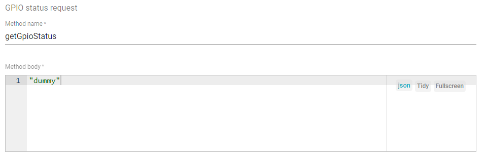

# Fundamental concepts

## Telemetry

Send data to thingsboard live demo page through HTTP by curl

* Step 1: Create Asset
* Step 2: Create devices
* Step 3: Make relation between Asset and devices
* Step 4: Start sending curl to live demo page

**With MQTT client**

Other MQTT client subscribes to Thingsboard MQTT's telemetry topic ``v1/devices/me/telemetry`` is unable to get the data

```sh
mosquitto_sub -h "demo.thingsboard.io" -t "v1/devices/me/telemetry" -u "O0kt6xUl6cTGv9RM7M9P"
```

## RPC

ThingsBoard allows you to send **remote procedure calls (RPC)** from server side applications to devices and vice versa. RPC is a two-way communication so in general it requires response from the client.

1 device can only control 1 control widget in the dashboard properly as the RPC return of 1 control widget is just: 

```
{"method":"setValue","params":false}
```

Many control widget added to 1 device in the dashboard just result in 1 type of RPC return like above so it is unable to distinguish which control widget has been pressed. 

In order to control many GPIO, use **GPIO widgets**.

### RPC controlling procedure with MQTT

**Step 1**: 

When device is connected to MQTT broker:

* Subscribe to ``v1/devices/me/rpc/request/+``
* Publish all GPIO status (in valid JSON form) to ``v1/devices/me/attributes``. GPIO status of all GPIO must be sent, if only some GPIO status of all existed GPIO in the GPIO widgets are missing, there will be error **Request time-out**.

**Step 2**: 

When pressing the GPIO button on GPIO widget, the request topic will be (e.g): ``v1/devices/me/rpc/request/111``

To handle MQTT response after pressing the GPIO button on GPIO widget:

* Publish the current GPIO status (in valid JSON form) to the response topic (which corresponds the request topic): E.g ``v1/devices/me/rpc/response/111``
* Publish the current GPIO status (in valid JSON form) to ``v1/devices/me/attributes``

**Notice**: If using only ``v1/devices/me/rpc/request/+`` (as one-way communication) for device controlling, there will be error **Request time-out**. With that error, GPIOs on GPIO widget can't change its state.

# Examples

Check implementation examples in [HTTP](HTTP.md) and [MQTT](MQTT.md)

## GPIO control save previous setup status

In the **Advanced tab** of **Basic GPIO Control** item, we have the setting section called **GPIO status request**



When dashboard initializes, this item publishs a MQTT message to topic **v1/devices/me/rpc/request/+** with an ID, its content is a JSON object include 2 keys that you see in the above settings. Below is an example for that case

```js
topic:  v1/devices/me/rpc/request/1680
message:  {"method":"getGpioStatus","params":"1"}
```

By response to back to the topic **v1/devices/me/rpc/response/1680** with the status of gpio state, we can change its status on the dashboard, thus save previous setup status with the status on the physical device. Noted that this content should also be published to **device attribute** topic for sync up the value that the dashboard takes for reference
