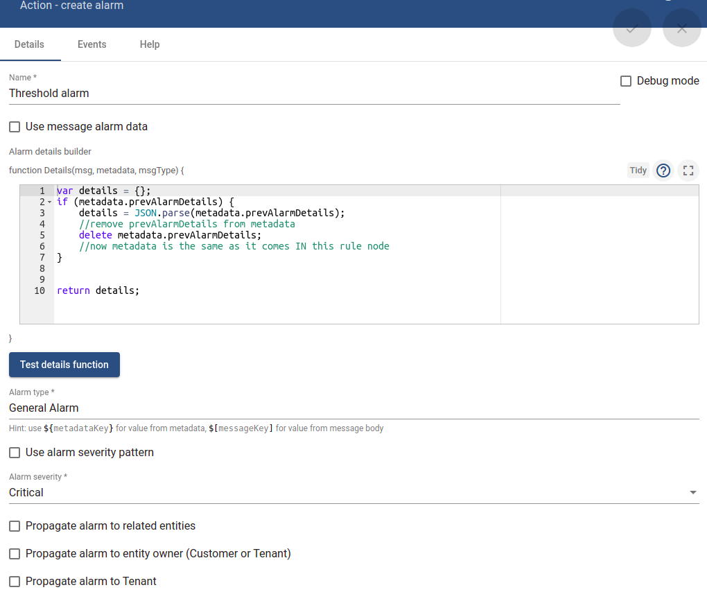
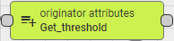
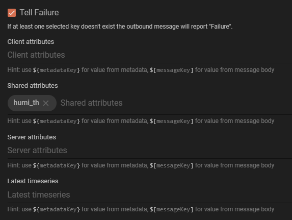
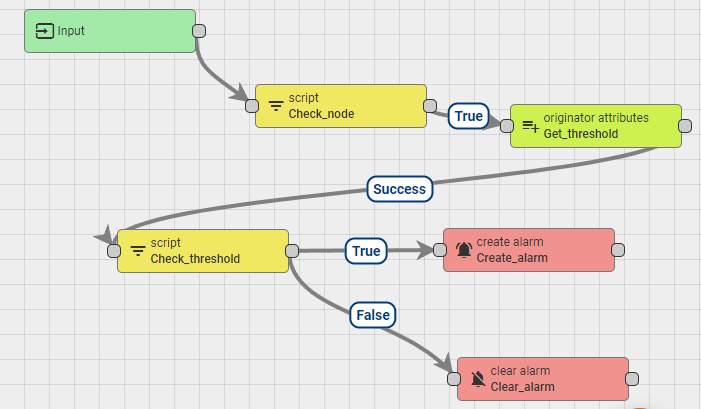

## Action: Alarm

Create a rule chain to trigger and clear alarm when specific event happen, e.g: value reach threshold

**Step 1**: Create **Script** (from **Filter**)

```js
return msg.temperature > 20;
```

**Step 2**: Create **create alarm** (from **Action**)

```js
var details = {};
if (metadata.prevAlarmDetails) {
    details = JSON.parse(metadata.prevAlarmDetails);
    //remove prevAlarmDetails from metadata
    delete metadata.prevAlarmDetails;
    //now metadata is the same as it comes IN this rule node
}

return details;
```

Let other value default, like the image below:




**Step 3**: In Root rule chain, connect the previously created alarm rulechain to root rule chain


**Step 4**: Send value that reaches threshold value to check alarm

```sh
curl -v -X POST -d "{\"temperature\": 25}" http://thingsboard.sysats.tech/api/v1/RbeNuZuf86rJ4zlY369i/telemetry --header "Content-Type:application/json"
```

Then in device with that specific token, in **Alarms**, a new alarm will be triggered as its **Status** is **Active Unacknowledged**

**Notice**: With all the setup like above (with no **clear alarm**), if another POST telemetry then happens that reaches threshold, the alarm won't be triggered as the alarm with type name (as setup above in **Step 2**) has already been triggered.

Action **clear alarm** can be used to clear the alarm every time the POST telemetry that doesn't reach threshold value. To setup **clear alarm**, let value default. 

To test, send the value that doesn't reach threshold value. Then in device with that specific token, in **Alarms**, a new alarm will be triggered as its **Status** is **Cleared Unacknowledged**.


### Send detail message

In create or clear alarm, to send a detail message:

Create alarm:

```js
var details = {};
details = metadata.deviceName + ": Threshold value has been reached";

return details;
```

Clear alarm:

```js
var details = {};
details = metadata.deviceName + ": Alarm has been cleared";

return details;
```

Then send value that reaches threshold value to check alarm. Go to the device with that specific token to check **Details** (in Details area):


The same Alarm details with details ``Relay: Alarm has been cleared`` will happen when the alarm is cleared.

## Action: Generator

Create a rule chain to generate dummy data and send those data to a device

### Instructions

**Step 1**: Create a new rule chain. After creating, **don't need to set Root priviledge**

**Step 2**: Click on the newly created rule chain and open it. In **Action** tab, choose **generator**.

**Step 3**: An example to set up for a **generator** action. To send data to a specific device, e.g ``Node device 1``, in ``Originator Type``, choose ``Device``, then in ``Device``, choose ``Node device 1``


**Step 4**: Link the newly created **generator** block rule chain to the **Root rule chain**. Choose link label **Success**. 

Choose **Root rule chain** from **Flow** -> **rule chain**.


Then press tick to enable the new rule chain.

### Result

With the set up in step 3, with JavaScript code:

```js
var msg = { temp: 42, humidity: 77 };
var metadata = { data: 40 };
var msgType = "POST_TELEMETRY_REQUEST";

return { msg: msg, metadata: metadata, msgType: msgType };
```

Then ``temp = 42`` and ``humidity=77`` will be send to device ``Node device 1`` for 1000 times in every 1 second. Go to device ``Node device 1`` to check the data.

To send random number from ``0`` to ``1`` to a device, take this script:

```js
var msg = { value: Math.random().toFixed(1) }; //to fix to limit to 1 number after ,
var metadata = { data: 40 };
var msgType = "POST_TELEMETRY_REQUEST";

return { msg: msg, metadata: metadata, msgType: msgType };
```

## Setup and clear alarm base on telemetry and threshold value

Create a rule chain to trigger and clear alarm when aquired value reaches a specific threshold define as a shared attribute of a device

**Step 1**: Create new rule chain ``setup_threshold`` and add all the necessary components

Get the **Script** in **Filter** and name it Check_node, its main duty is checking to see if the message comes from the right node


And for this case, the content is **Node device 1**

```js
return metadata.deviceName == "Node device 1";
```

Get the **originator attributes** in **Enrichment** and name it Get_threshold, it will add the value for a specific key in device attribute to the metadata object



The configuration is pretty straight foward, we enter the target attribute key we want to get, here is the **humi_th** which already added in Shared attributes section of **Node device 1**



Get the second **Script** in **Filter** and name it Check_threshold, at this node we will compare the monitor value with the threshold


As previously mentioned, the threshold value we get from Shared attributes will be added to metadata object with a prefix "**shared_**". Other prefix for client or server attributes is mentiond in thingsboard documents

```js
return msg.humidity > metadata.shared_humi_th;
```

For the last two node, get the **create alarm** and **clear alarm** from **Action**. All the configuration in these node are default

**STEP 2**: Link all the components follow this order



**STEP 3**: Link the design rule chain to root rule chain


We link it with the **Post telemetry** message type because we're checking the value from the post telemetry event

For threshold setup, user can set it on the shared attributes of the device and use the ``Update shared double attribute`` widget in dashboard.
