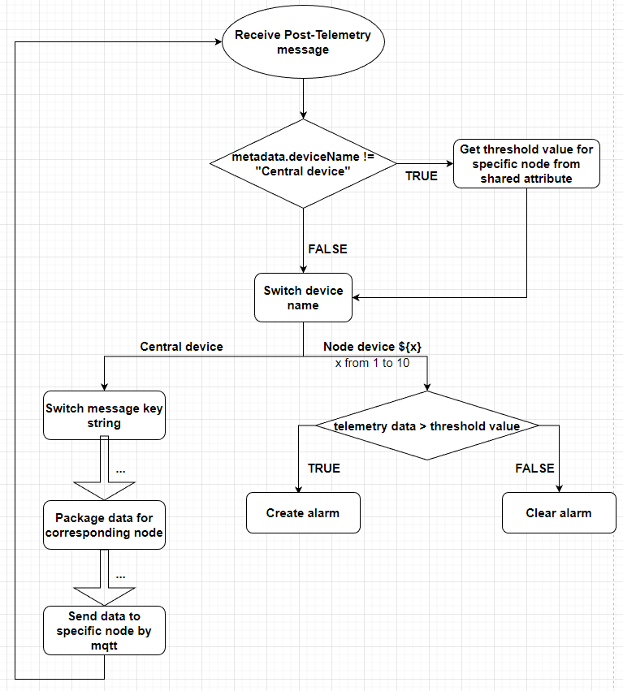
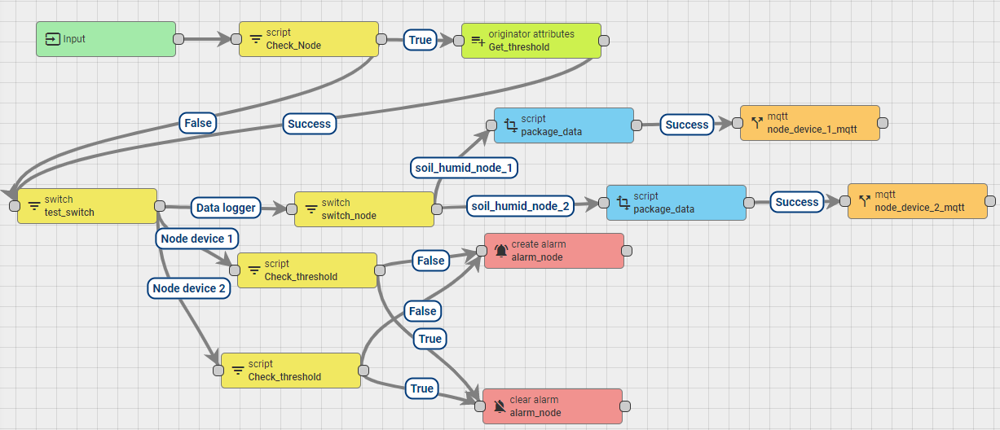

# Features

* Trigger alarm when 2 node values soil_humid_node_1 and soil_humid_node_1 are smaller than the threshold setup value of each node ``shared_humi_th``
* Multiple nodes (e.g 2 nodes) want to acquire this alarm functionality but they don't have the direct connection to ThingsBoard cluster and they have to go through a phyiscal device data logger to sync up data.

# Implementation

To achieve this requirement, we design a simple work arround flow by routing the telemetry data received by the data logger through the MQTT item in ThingsBoard. By this way, the post-telemetry flow in root chain will be triggered again by a specific node, so in that flow we can compare the telemetry data with the threshold value from the trigger node and create an alarm that corresponding to that node. This flow chart below explain it in details.

The rule chain implemented with the flow chart is pretty straigh forward

2 external MQTT block in this rule chain has the access token of 2 node devices for MQTT message publishing.
