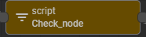
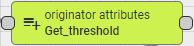
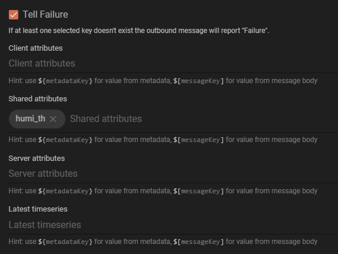
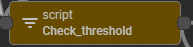
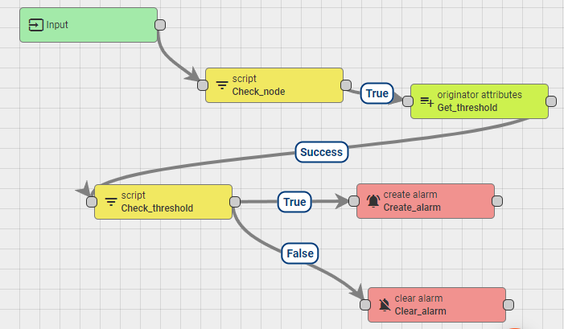
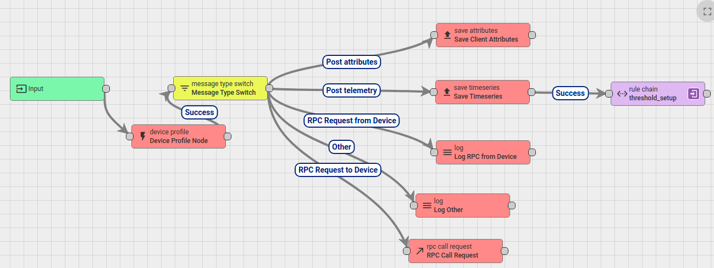

## Setup and clear alarm base on telemetry and threshold value

Create a rule chain to trigger and clear alarm when aquired value reaches a specific threshold define as a shared attribute of a device

**Step 1**: Create new rule chain ``setup_threshold`` and add all the necessary components

Get the **Script** in **Filter** and name it Check_node, its main duty is checking to see if the message comes from the right node



And for this case, the content is **Node device 1**

```js
return metadata.deviceName == "Node device 1";
```

Get the **originator attributes** in **Enrichment** and name it Get_threshold, it will add the value for a specific key in device attribute to the metadata object



The configuration is pretty straight foward, we enter the target attribute key we want to get, here is the **humi_th** which already added in Shared attributes section of **Node device 1**



Get the second **Script** in **Filter** and name it Check_threshold, at this node we will compare the monitor value with the threshold



As previously mentioned, the threshold value we get from Shared attributes will be added to metadata object with a prefix "**shared_**". Other prefix for client or server attributes is mentiond in thingsboard documents

```js
return msg.humidity > metadata.shared_humi_th;
```

For the last two node, get the **create alarm** and **clear alarm** from **Action**. All the configuration in these node are default

**Step 2**: Link all the components follow this order



**Step 3**: Link the design rule chain to root rule chain



We link it with the **Post telemetry** message type because we're checking the value from the post telemetry event

**Step 4**: Setup threshold on dashboard

For threshold setup, user can set it on the shared attributes of the device and use the ``Update shared double attribute`` widget in dashboard.
