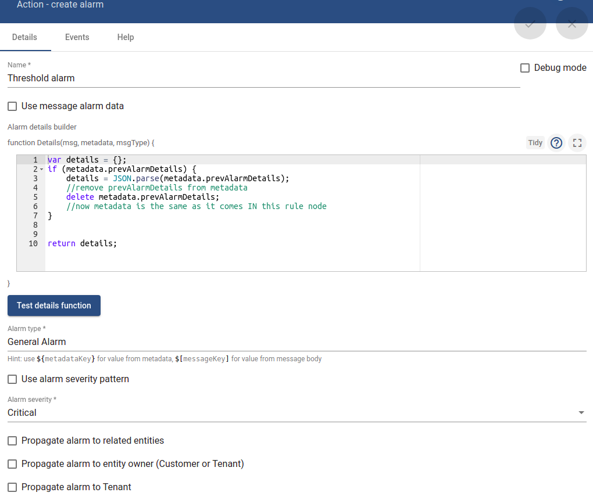
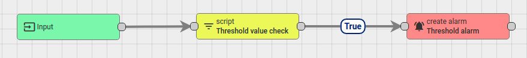
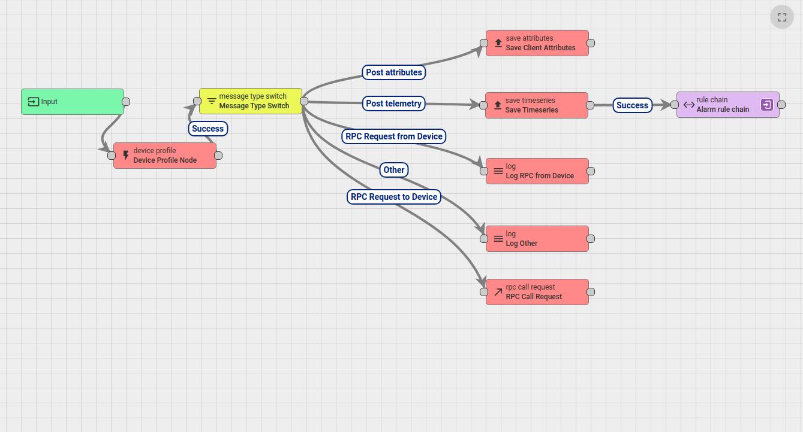
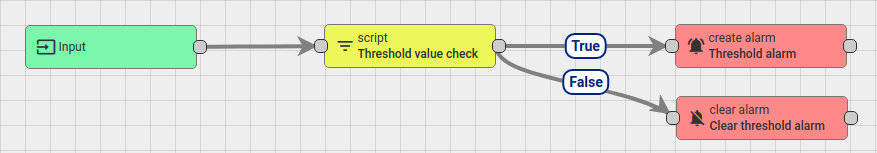
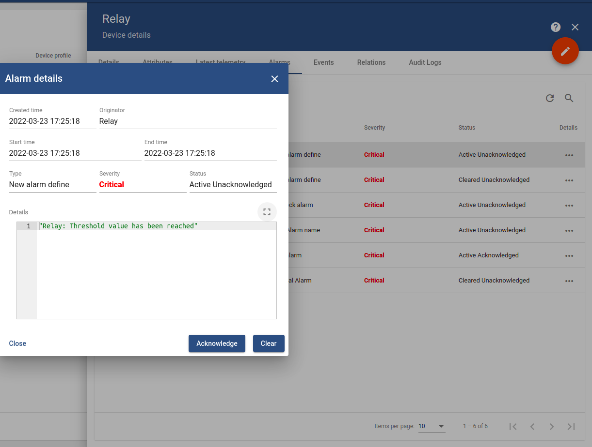

## Create rule chain to trigger and clear alarm when specific event happen

Create rule chain **Alarm rule chain** to trigger and clear alarm when specific event happen, e.g: value reach threshold

**Step 1**: Create an empty rule chain and name it **Alarm rule chain**

**Step 2**: In **Alarm rule chain**, create **Script** (from **Filter**)

```js
return msg.temperature > 20;
```

Then create **create alarm** (from **Action**)

```js
var details = {};
if (metadata.prevAlarmDetails) {
    details = JSON.parse(metadata.prevAlarmDetails);
    //remove prevAlarmDetails from metadata
    delete metadata.prevAlarmDetails;
    //now metadata is the same as it comes IN this rule node
}

return details;
```

Let other value default, like the image below:



Then **Alarm rule chain** now will be:



**Step 3**: In Root rule chain, connect the **Alarm rule chain** rulechain to root rule chain



**Step 4**: Send value that reaches threshold value to any ThingsBoard device to trigger that alarm

```sh
curl -v -X POST -d "{\"temperature\": 25}" http://thingsboard.sysats.tech/api/v1/RbeNuZuf86rJ4zlY369i/telemetry --header "Content-Type:application/json"
```

Then in the device with that specific token, in **Alarms**, a new alarm will be triggered as its **Status** is **Active Unacknowledged**

**Notice**: With all the setup like above (with no **clear alarm**), if another POST telemetry then happens that reaches threshold, the alarm won't be triggered as the alarm with type name (as setup above in **Step 2**) has already been triggered.

Action **clear alarm** can be used to clear the alarm every time the POST telemetry that doesn't reach threshold value. To setup **clear alarm**, let value default. 

To test, send the value that doesn't reach threshold value. Then in device with that specific token, in **Alarms**, a new alarm will be triggered as its **Status** is **Cleared Unacknowledged**.



## Send detail message

In create or clear alarm, to send a detail message:

Create alarm:

```js
var details = {};
details = metadata.deviceName + ": Threshold value has been reached";

return details;
```

Clear alarm:

```js
var details = {};
details = metadata.deviceName + ": Alarm has been cleared";

return details;
```

Then send value that reaches threshold value to check alarm. Go to the device with that specific token to check **Details** (in Details area):



The same Alarm details with details ``Relay: Alarm has been cleared`` will happen when the alarm is cleared.

## Setup and clear alarm base on telemetry and threshold value

Check [the document of the same name](Alarm%20and%20threshold.md) for rule chain to trigger and clear alarm when aquired value reaches a specific threshold define as a shared attribute of a device

This method is only available for 1 device to map to 1 alarm. For 1 alarm to handle multiple devices, check [alarm and threshold for multiple devices(Alarm%20and%20threshold%for%multiple%devices.md) 
