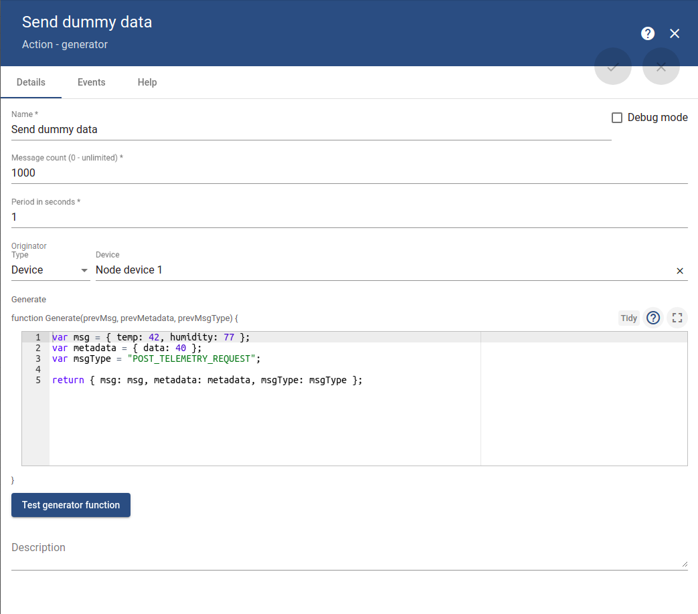
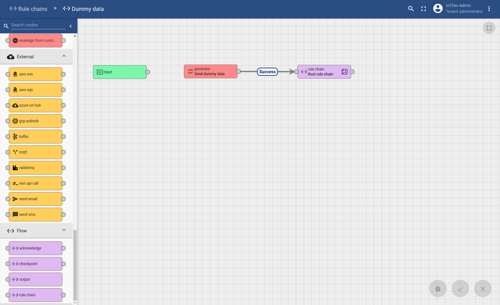

Create a rule chain to generate dummy data and send those data to a device

### Instructions

**Step 1**: Create a new rule chain. Then click on the newly created rule chain and open it. In **Action** tab, choose **generator**.

**Step 2**: An example to set up for a **generator** action. To send data to a specific device, e.g ``Node device 1``, in ``Originator Type``, choose ``Device``, then in ``Device``, choose ``Node device 1``



**Step 3**: Link the newly created **generator** block rule chain to the **Root rule chain** (choose **Root rule chain** from **Flow** -> **rule chain**). Choose link label **Success**. This will make link to the **POST_TELEMETRY_REQUEST** in **Message Type Switch** in Root rule chain.



Then press tick to enable the new rule chain.

As this newly created rule chain is now connected to **Root rule chain**, it mustn't be chosen **Root priviledge** (chosen as **Root rule chain**) as the rule in **Root rule chain** must still be enable for **POST_TELEMETRY_REQUEST** communication.

### Result

With the set up in **step 2**, with JavaScript code:

```js
var msg = { temp: 42, humidity: 77 };
var metadata = { data: 40 };
var msgType = "POST_TELEMETRY_REQUEST";

return { msg: msg, metadata: metadata, msgType: msgType };
```

Then ``temp = 42`` and ``humidity=77`` will be send to device ``Node device 1`` for 1000 times in every 1 second. Go to device ``Node device 1`` to check the data.

``msgType`` ``POST_TELEMETRY_REQUEST`` will be treated by ``Message Type Switch`` in ``Root rule chain``.

``medatadata`` will then be send from **Send dummy data** generator block to block **Root rule chain**. To view those value, enable Debug mode in **Root rule chain**. Then in  **Root rule chain** block with tab ``Events``, choose Event types ``Debug`` to view.

To send random number from ``0`` to ``1`` to a device, take this script:

```js
var msg = { value: Math.random().toFixed(1) }; //to fix to limit to 1 number after ,
var metadata = { data: 40 };
var msgType = "POST_TELEMETRY_REQUEST";

return { msg: msg, metadata: metadata, msgType: msgType };
```
