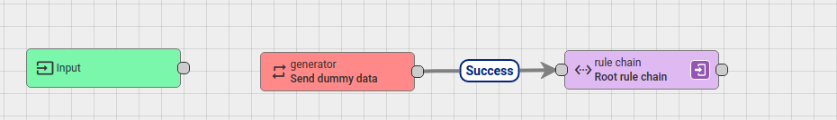

Create a rule chain to generate dummy data and send those data to a device

### Instructions

**Step 1**: Create a new rule chain. After creating, **don't need to set Root priviledge**

**Step 2**: Click on the newly created rule chain and open it. In **Action** tab, choose **generator**.

**Step 3**: An example to set up for a **generator** action. To send data to a specific device, e.g ``Node device 1``, in ``Originator Type``, choose ``Device``, then in ``Device``, choose ``Node device 1``


**Step 4**: Link the newly created **generator** block rule chain to the **Root rule chain**. Choose link label **Success**. 

Choose **Root rule chain** from **Flow** -> **rule chain**.



Then press tick to enable the new rule chain.

### Result

With the set up in step 3, with JavaScript code:

```js
var msg = { temp: 42, humidity: 77 };
var metadata = { data: 40 };
var msgType = "POST_TELEMETRY_REQUEST";

return { msg: msg, metadata: metadata, msgType: msgType };
```

Then ``temp = 42`` and ``humidity=77`` will be send to device ``Node device 1`` for 1000 times in every 1 second. Go to device ``Node device 1`` to check the data.

To send random number from ``0`` to ``1`` to a device, take this script:

```js
var msg = { value: Math.random().toFixed(1) }; //to fix to limit to 1 number after ,
var metadata = { data: 40 };
var msgType = "POST_TELEMETRY_REQUEST";

return { msg: msg, metadata: metadata, msgType: msgType };
```