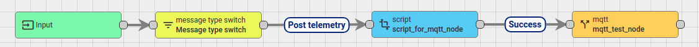
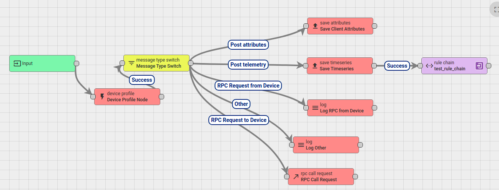
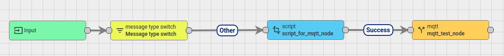
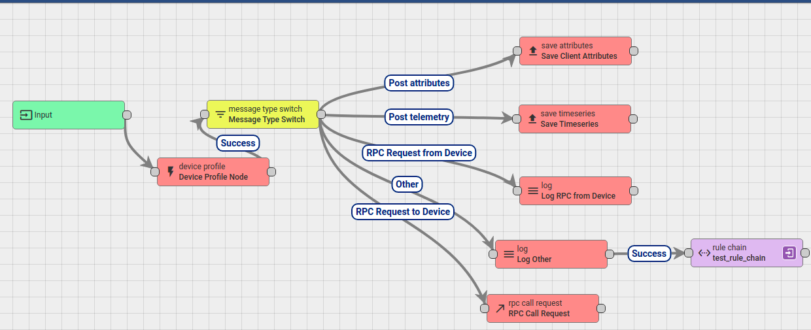
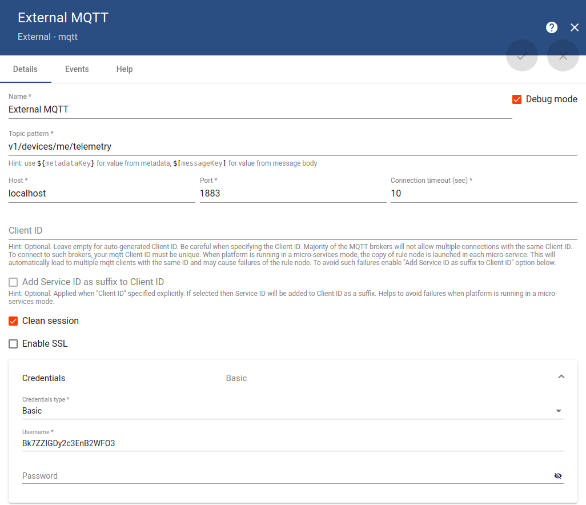
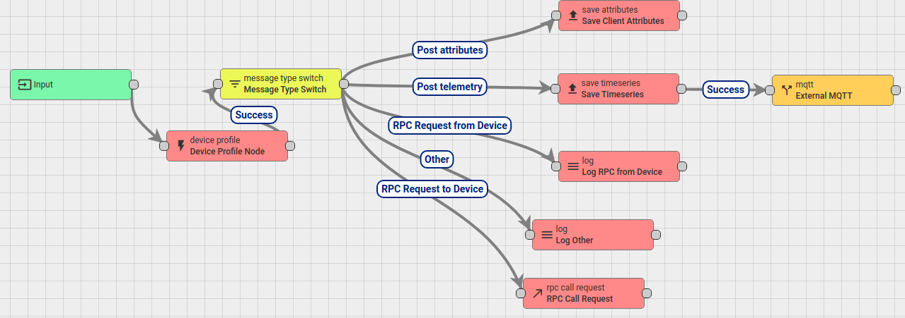

# Post telemetry message type

Publisher: Publish a MQTT message to any device on telemetry topic ``v1/devices/me/telemetry`` to trigger Post telemetry message type.

Subscriber: Subsribe to the EMQ broker topic to receive the message returned from ``script transformation`` block

## Implementations

**Step 1**: Set message type switch to Post telemetry

**Step 2**: Use ``script transformation`` to redirect the received MQTT message to the MQTT external node

In this case, use the default script:

```js
function Transform(msg, metadata, msgType){
    return {msg: msg, metadata: metadata, msgType: msgType};
}
```

**Step 3**: In MQTT externel node, setup parameters:

* Name: (give any name)
* Topic pattern: ``mqtt_test_node_thingsboard`` (Give any name to this MQTT topic)
* Host: broker.emqx.io
* Port: 1883
* Credential: If choose Anonymous, give no username as there is no authentication. If choose Basic, provide username

Rule chain



Then add it to root rule chain



**Step 4**:

**Publisher**:

```sh
mosquitto_pub -d -h "thingsboard.sysats.tech" -t "v1/devices/me/telemetry" -u "lWMLHJCyb9zPNMMpXQkI" -m "{'data': 'Hello, World'}"
```

With ``lWMLHJCyb9zPNMMpXQkI`` is the access token/MQTT username of a device to trigger the Post telemetry message type

**Subscriber**:

When setting credential to Anonymous:

```sh
mosquitto_sub -h "broker.emqx.io" -t "mqtt_test_node_thingsboard"
```

With the ``script transformation`` setup like above, subscriber will receive ``{'data': 'Hello, World'}``.

To send a specific string to MQTT external node every time Post telemetry message type is triggered, change the ``script transformation`` like this:

```js
function Transform(msg, metadata, msgType){
    var data = {
        "field_1": "Field 1",
        "field_2": "Field 2"
    };
    return {msg: data, metadata: metadata, msgType: msgType};
}
```

# Other message type

If setting MQTT externel node like this for **Other message type**





Then subscribe and publish:

```sh
mosquitto_sub -h "broker.emqx.io" -t "mqtt_test_node_thingsboard"

mosquitto_pub -d -h "thingsboard.sysats.tech" -t "any_topic" -u "lWMLHJCyb9zPNMMpXQkI" -m "{'data': 'Hello, World'}"
```

Then the subscriber won't receive any message as ThingsBoard by default doesn't support publishing message to random topic.

# Self publish to local broker

Use external MQTT rule chain to publish the received message to another device inside the local broker when broker receives a post telemetry message to a device.

Set up this external MQTT rule chain with that detail



With that detail setup, the received MQTT message will be published to a device with token ``Bk7ZZIGDy2c3EnB2WFO3``.



With that root rule chain setup, trigger **Post telemetry** by publishing to any device: 

```sh
mosquitto_pub -d -h "thingsboard.sysats.tech" -t "v1/devices/me/telemetry" -u "lWMLHJCyb9zPNMMpXQkI" -m "{'data': 'Hello, World'}"
```

Now both device with token ``Bk7ZZIGDy2c3EnB2WFO3`` and ``lWMLHJCyb9zPNMMpXQkI`` will receive the same message ``{'data': 'Hello, World'}``.