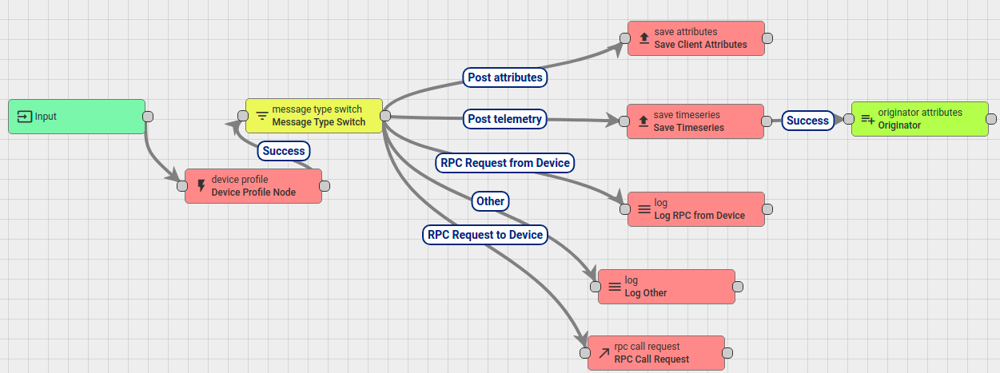
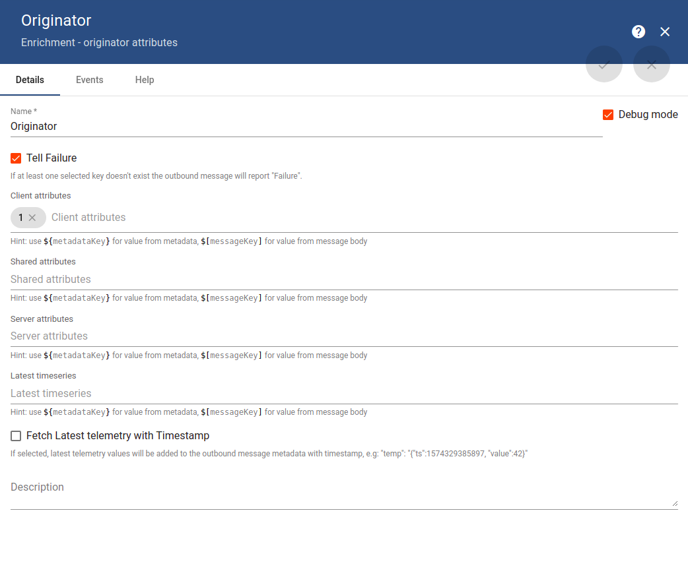
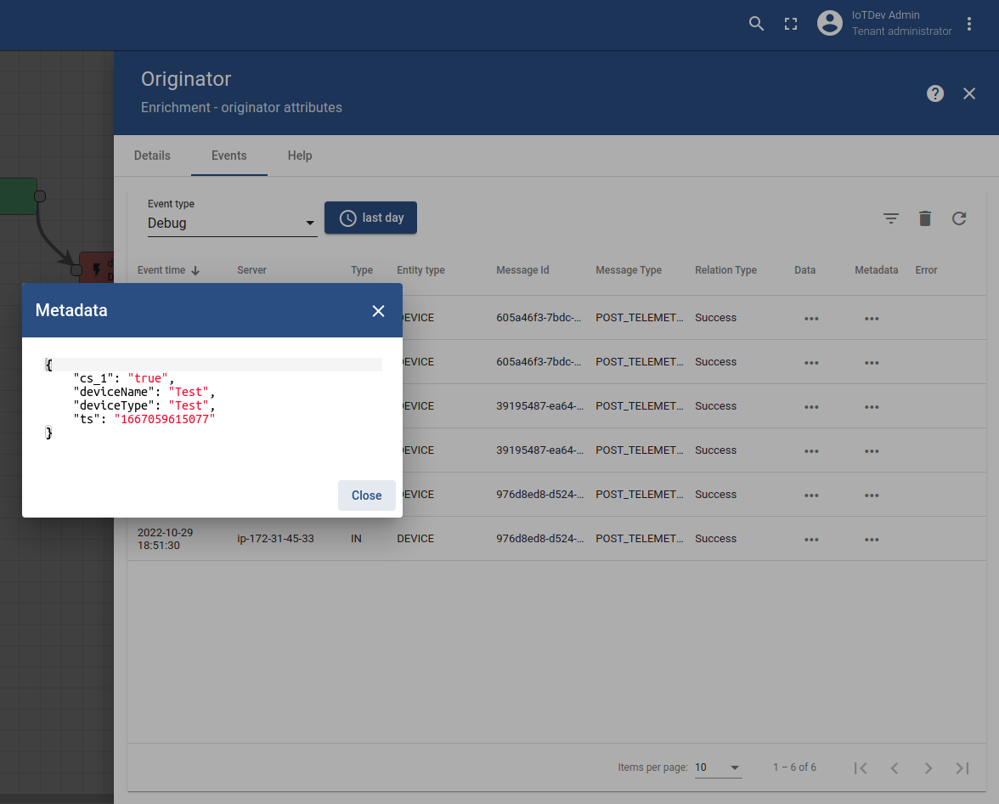

Originator attributes is used to add Message originator attributes (client\shared\server attributes) and latest telemetry value into Message Metadata. View that message meta in ``Debug`` in ``Event`` tab.

Attributes are added into metadata with scope prefix:

* client attribute -> ``cs_``
* shared attribute ->  ``shared_``

## Client attribute example

Create a message metatdata include a client attribute of a node when a MQTT message is published to that node

**Step 1**: Set up root rule chain with Originator attributes like this



Details setup for that originator attributes 



Client attributes ``1`` in that details setup is existed client attributes in the device used for testing in **step 2**.

**Step 2**: Publish a MQTT message to trigget that originiator attributes

```c
mosquitto_pub -d -h "thingsboard.sysats.tech" -t "v1/devices/me/telemetry" -u "lWMLHJCyb9zPNMMpXQkI" -m "{'value': 'Hello, World !'}"
```

Device with token ``lWMLHJCyb9zPNMMpXQkI`` is the device that already has client attributes ``1``.

**Step 3**: Check Metadata in Events of the originiator attributes. ``cs_1`` will existed.



In this case, ``cs`` is for client attributes and ``1`` is that client attribute's name.

## Shared attribute example

Check [Alarm and threshold example](https://github.com/TranPhucVinh/Linux-Shell/blob/master/Platforms%20interaction/ThingsBoard/Rule%20chain/Alarm%20and%20threshold.md) for implementation with shared attribute.
