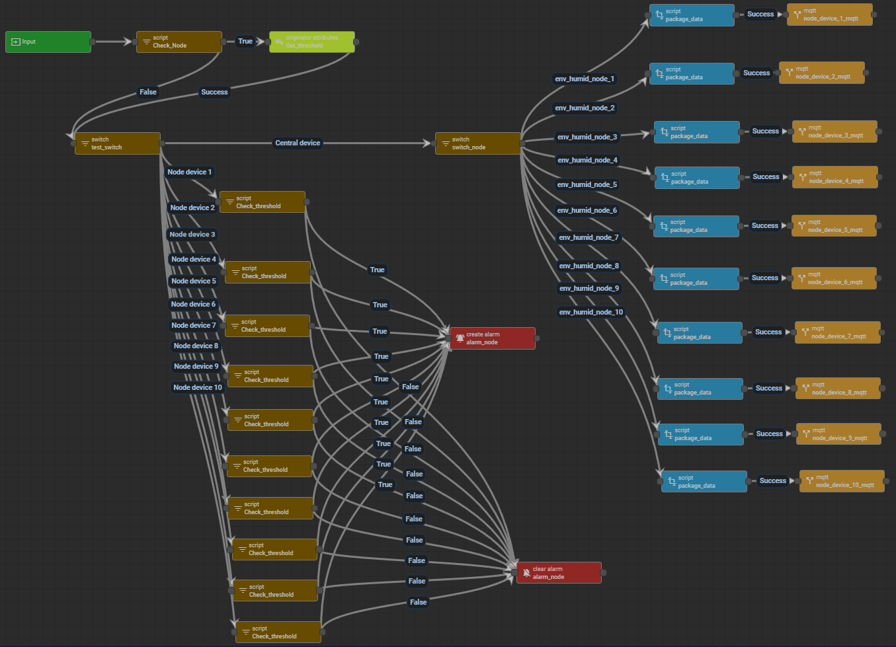

# Setup alarm and threshold for 10 nodes

From previous section about alarm and threshold, we know that one alarm can only be used by 1 device in thingsboard. This creates some difficulties for the scenario where we have multiple nodes acquire this alarm functionality but they don't have the direct connection to thingsboard cluster and they have to go through a central node for sync up data.

To achieve this requirement, we design a simple work arround flow by routing the telemetry data received by central device through the mqtt item in thingsboard. By this way, the post-telemetry flow in root chain will be triggered again by a specific node, so in that flow we can compare the telemetry data with the threshold value from the trigger node and create an alarm that corresponding to that node. This flow chart below explain it in details.

The rule chain implemented with the flow chart is pretty straigh forward

