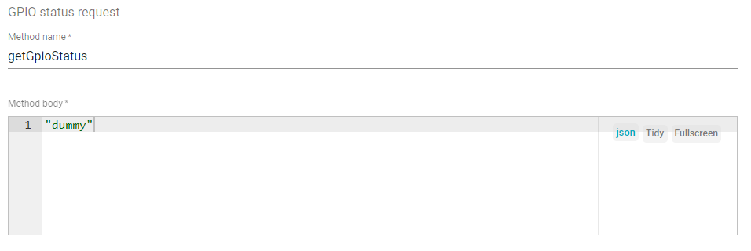

# Connect existed device to widget on dashboard

Create button widget to control device

### Step 1

Create a new dashboard, and a new widget

### Step 2

A new widget can be, e.g ``Timeseries Line Chart``. After creaing a new widget, there will be a tab 
``Add Widget: Timeseries Line Chart``. In that tab, there will be 4 small tabs: `` Data``, ``Settings``, ``Advanced``, ``Actions``.

In tab ``Data`` -> ``Datasources``, press ``+Add`` button:

* **Type**: Entity
* **Parameter**: There are **Entity aliases** and **Filter**. Create a new **Entity aliases** or choose the existed **Entity aliases**. 
If there is no filter condition, leave **Filter** empty.

**Create a new Entity aliases**

* **Alias name**: Add the alias name
* **Filter type**: Single entity
* **Type**: Device. Then choose the device from the existed devices that wished to control

After creating the new Entity aliases, choose then **entity timeseries** to visualize data.

# Control widget

### RPC button

When pressing the RPC button widget, a message is broadcasted to any subscribe MQTT client:

Subscribe to topic ``v1/devices/me/rpc/request/+`` to listen to the broadcasted message

```sh
mosquitto_sub -d -h "thingsboard.sysats.tech" -t "v1/devices/me/rpc/request/+" -u "TTf3zmVacJI4dUQsYQwh"
```

For customized responsed message, in Advanced tab, update the message in ``rpcCommand`` to any valid JSON value

```json
{"message": "Hello, World"}
```

### Knob control

Knob control is not yet implemented in Linux Shell, check [the corresponding RPC examples in ESP-IDF for its implementation](https://github.com/TranPhucVinh/ESP-IDF/blob/master/Platforms%20interaction/ThingsBoard/MQTT/README.md#rpc)

# GPIO widget

## GPIO control widget

For RPC controlling procedure for GPIO control widget, check [RPC document](https://github.com/TranPhucVinh/Linux-Shell/blob/master/Platforms%20interaction/ThingsBoard/Device%20API.md#rpc).

### GPIO control save previous setup status

In the **Advanced tab** of **Basic GPIO Control** item, we have the setting section called **GPIO status request**



We can setup any value to it, like string ``dummy`` to return this value to the MQTT subscriber.

When dashboard initializes, this item publishs a MQTT message to topic **v1/devices/me/rpc/request/+** with an ID, its content is a JSON object include 2 keys that you see in the above settings. Below is an example for that case

```js
topic:  v1/devices/me/rpc/request/1680
message:  {"method":"getGpioStatus","params":"1"}
```

By response to back to the topic **v1/devices/me/rpc/response/1680** with the status of gpio state, we can change its status on the dashboard, thus save previous setup status with the status on the physical device. Noted that this content should also be published to **device attribute** topic for sync up the value that the dashboard takes for reference

## GPIO panel widget

GPIO panel widget is used to display online/offline status of its pins based on the attributes of the device mapping to it.

Attributes used for setting up the status is the client attributes of the device.

In tab ``Data``, choose **Entity** with the entity alias of the device for online/offline status displayed. Then choose the client attribute of it. In label, set the label to the pin number, i.e set label to ``1`` for pin number ``1``.

JSON field value of the pin number must have boolean type, i.e ``true`` (for online) and ``false``.

E.g: Set online status for pin number ``1``

```sh
mosquitto_pub -d -h "thingsboard.sysats.tech" -t "v1/devices/me/attributes" -u "TTf3zmVacJI4dUQsYQwh" -m "{\"1\":true}"
```

# Input widgets

Update attribute widgets allow updating attributes to entity like devices.

Update attribute widgets have been covered so far are ``Update shared double attribute`` and ``Update shared integer attribute``.

Check **Example: Create a double share attribute of a device then connect it to the Update shared double attribute widget in dashboard** in [Device attributes](https://github.com/TranPhucVinh/Linux-Shell/tree/master/Platforms%20interaction/ThingsBoard#device-attributes) for implementation of this.

# Map

**Step 1**: Create a map form map widget, then connect the device to that widget

**Step 2**: Choose the timeseries from that device with valid longitude and latitude to be displayed as the longitude and latitude on the map.

**Implementation**: Not yet implemented in Linux Bash Shell framework, check [the corresponding implementation in Python](https://github.com/TranPhucVinh/Python/blob/master/Platforms%20interaction/ThingsBoard/MQTT.md#map-widget).
