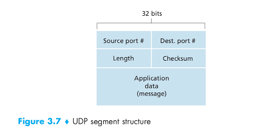

# UDP: User datagram protocol

Note that with UDP there is no handshaking between sending and receiving transport-layer entities before sending a segment. For this reason, UDP is said to be connectionless.

**DNS is an example of an application-layer protocol that typically uses UDP**. When the DNS application in a host wants to make a query, it constructs a DNS query message and passes the message to UDP. **Without performing any handshaking with the UDP entity running on the destination end system**, the host-side UDP adds header fields to the message and passes the resulting segment to the network layer. The network layer encapsulates the UDP segment into a datagram and sends the datagram to a name server. The DNS application at the querying host then waits for a reply to its query. **If it doesn’t receive a reply** (possibly because the underlying network lost the query or the reply), either **it tries sending the query to another name server**, or **it informs the invoking application that it can’t get a reply**.

UDP is prefer to use with application that can tolerate a little dataloss and require real time as:

* **No connection establishment**: TCP uses a three-way handshake before it starts to transfer data. UDP just blasts away without any formal preliminaries. Thus UDP does not introduce any delay to establish a connection. This is probably the principal reason why DNS runs over UDP rather than TCP—DNS would be much slower if it ran over TCP. HTTP uses TCP rather than UDP, since reliability is critical for Web pages with text. The TCP connection-establishment delay in HTTP is an important contributor to the delays associated with downloading Web documents.

* **No connection state**: **TCP** maintains connection state in the end systems. This connection state includes receive and send buffers, congestion-control parameters, and sequence and acknowledgment number parameters. UDP, on the other hand, does not maintain connection state and does not track any of these parameters. For this reason, a server devoted to a particular application can typically support many more active clients when the application runs over UDP rather than TCP.

* **Small packet header overhead**: The TCP segment has 20 bytes of header over-head in every segment, whereas UDP has only 8 bytes of overhead.

Although commonly done today, **running multimedia applications over UDP is controversial**. As we mentioned above, UDP has no congestion control. **But congestion control is needed to prevent the network from entering a congested state in which very little useful work is done**. **If everyone were to start streaming high-bit-rate video without using any congestion control, there would be so much packet overflow at routers that very few UDP packets would successfully traverse the source-to-destination path**. Moreover, the high loss rates induced by the uncontrolled UDP senders would cause the TCP senders (which, as we’ll see, do decrease their sending rates in the face of congestion) to dramatically decrease their rates. Thus, **the lack of congestion control** in UDP can result in high loss rates between a UDP sender and receiver, and the crowding out of TCP sessions—a potentially serious problem.

**UDP Segment Structure**

**The UDP segment structure, shown in Figure 3.7, is defined in RFC 768**. **The application data occupies the data field** of the UDP segment. For example, for DNS, the data field contains either a query message or a response message. For a streaming audio application, audio samples fill the data field.

**The UDP header has only four fields**, each consisting of **two bytes**. As discussed in the previous section, the port numbers allow the destination host to pass the application data to the correct process running on the destination end system (that is, to perform the demultiplexing function). **The length field** specifies the number of bytes in the UDP segment (header plus data).
**An explicit length value** is needed since the size of the data field may differ from one UDP segment to the next. **The checksum** is used by the receiving host to check whether errors have been introduced into the segment. 

In truth, the checksum is also calculated over a few of the fields in the IP header in addition to the UDP segment. But we ignore this detail in order to see the forest through the trees.

# Reliable data transfer

**Reliable Data Transfer over a Perfectly Reliable Channel: rdt1.0**

**Reliable Data Transfer over a Channel with Bit Errors: rdt2.0**

The send side of **rdt2.0** has two states. In the leftmost state, the send-side protocol is waiting for data to be passed down from the upper layer. When the ``rdt_send(data)`` event occurs, the sender will create a packet (sndpkt) containing the data to be sent, along with a packet checksum (for example, as  for the case of a UDP segment), and then send the packet via the ``udt_send(sndpkt)`` operation. In the rightmost state, the sender protocol is waiting for an **ACK** or a **NAK** packet from the receiver.

**If an ACK packet is received** (the notation ``rdt_rcv(rcvpkt)`` && ``isACK (rcvpkt)``), the sender knows that the most recently transmitted packet has been received correctly and thus the protocol returns to the state of waiting for data from the upper layer.
**If a NAK is received**, **the protocol retransmits the last packet** and **waits for an ACK or NAK** to be returned by the receiver in response to the retransmitted data packet.

**It is important to note that when the sender is in the wait-for-ACK-or-NAK
state, it cannot get more data from the upper layer; that is, the rdt_send() event can not occur**; **that will happen only after the sender receives an ACK and leaves this state**.
Thus, the sender will not send a new piece of data until it is sure that the receiver has correctly received the current packet.

Because of this behavior, protocols such as rdt2.0 are known as **stop-and-wait protocols**.

**Reliable Data Transfer over a Lossy Channel with Bit Errors: rdt3.0**

How long must the sender wait to be certain that something has been lost?

The sender must clearly wait at least as long as a **round-trip delay** between the sender and receiver (which may include buffering at intermediate routers) plus whatever **amount of time is needed to process a packet at the receiver**.

From the sender’s viewpoint, retransmission is a panacea. **The sender does not
know whether a data packet was lost, an ACK was lost, or if the packet or ACK was simply overly delayed**. In all cases, the action is the same: retransmit. 

Implementing a time-based retransmission mechanism **requires a countdown timer** that can interrupt the sender after a given amount of time has expired. The sender will thus need to be able to (1) **start the timer each time a packet** (either a first-time packet or a retransmission) **is sent**, (2) **respond to a timer interrupt** (taking appropriate actions), and (3) **stop the timer**.

# Problem lead people to develop Go-Back-N protocol and Selective Repeat protocol

Whit stop-and-wait as ffter receving an ACK, the next whole packet is sent; this lead to a large amount of time wasting (calculation in 3.17).

Rather than operate in a stop-and-wait manner, the sender is allowed to send multiple packets without waiting for acknowledgments.

Since the **many in-transit sender-to-receiver packets** can be visualized as filling a pipeline, this technique is known as **pipelining**. 

Two basic approaches toward pipelined error recovery can be identified: **Go-Back-N** and **selective repeat**.

# Go-Back-N

In a **Go-Back-N (GBN)** protocol, the sender is allowed to transmit multiple packets (when available) without waiting for an acknowledgment, but is constrained to have **no more than some maximum allowable number, N, of unacknowledged packets in the pipeline**.

The **GBN protocol** itself as a **sliding-window protocol**.

# Selective repeat

The GBN protocol allows the sender to potentially “fill the pipeline” with packets, thus avoiding the channel utilization problems we noted with stop-and-wait protocols.
There are, however, scenarios in which GBN itself suffers from performance problems. In particular, when the window size and bandwidth-delay product are both large, many packets can be in the pipeline. A single packet error
can thus cause GBN to retransmit a large number of packets, many unnecessarily.

As the probability of channel errors increases, the pipeline can become filled with these unnecessary retransmissions.